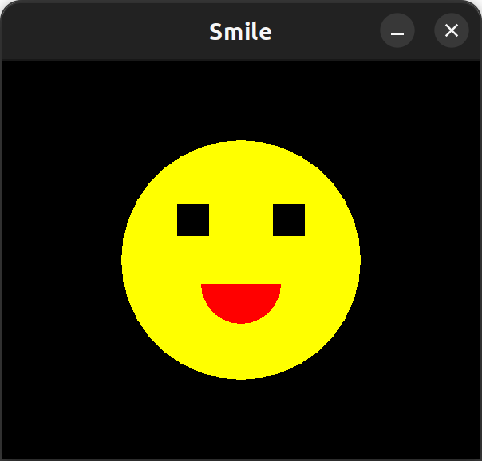

# The Iris Tutorial

In this tutorial I will assume that you are proficient in Uiua. If you are not,
read [the Uiua tutorial](https://www.uiua.org/tutorial/introduction) first. But
I will *not* assume that you have any experience with
[Raylib](https://www.raylib.com/) or any particular game framework.

## An Introduction

Iris is library that bridges the gap between Uiua and Raylib. Raylib is a
popular lightweight game library written in C. C is a very different language
from Uiua, so functions and APIs that make good sense in C can be difficult and
clumsy to use in Uiua. Iris lets you focus on the Uiua code, and not have to
think about the underlying C operations.

Iris offers a host of different features to enable making games. These are the
following:

- Manipulating a window where your game will display
- Drawing shapes and images onto the screen
- Interacting with the mouse
- Interacting with the keyboard
- Detecting collisions with various shapes

These features are organized into different
[modules](https://www.uiua.org/tutorial/modules) so that names can be shorter.

Let's spin up a simple example that is the scaffolding of almost Iris project.

```uiua
# Experimental!
I ~ "git: github.com/Marcos-cat/iris"

I~Open 800_500 "The Title"

I~Loop!(
  I~Draw~Background Purple
)
```

We start by importing Iris from GitHub. I like to import it as `I` because
`Iris` everywhere is a little too busy for me, but how you choose to import it
is up to you.

The next line is setting up the window with `Open`. `Open` takes the dimensions
of the window and a title to name the window. `Open` well, opens the window.
Many functions must be called after calling `Open`, or the program might crash.
If a function has to be called like this it will say so in its documentation.
But to play it safe, Iris functions should generally be called after `Open`.

The final section is the most important: the `Loop!` macro. The function you
give to `Loop!` is called every single frame to render your project. `Loop!`
ends once the user closes out of the window, or when they press the escape key.
Here, the function passed to `Loop!` is `I~Draw~Background Purple`. This
introduces the `Draw` module, and the `Background` function within it.
`Background` takes a color and fills the whole window with that color.

Something to notice is that `Purple` is not a binding imported from Iris. It is
a built-in constant in Uiua. Iris uses colors the same way that Uiua uses colors
for images. There is no need to do any conversions to and from color spaces if
you don't want to.

A few changes can be make to the above example that don't change how it behaves.

*Note: future examples won't include the import statements, they are implied.*

```uiua
I~Open ℂ800 500 "The Title"

I~Loop!(
  I~Draw~Background "#8000ff"
)
```

The first and more important change is one of the most central things to Iris:
2d vectors, whether they are dimensions (like for the window), or a position on
the window, can be *complex numbers*. Using complex numbers instead of arrays
with a trailing 2-long axis has a number of upsides. Algebra tends to be easier
with complex numbers than with vectors in Uiua. The other change to note is that
the color constant `Purple` can be replaced with a hex code string.

## Drawing

As mentioned before, Iris is organized into different modules. You've already
gotten a sneak-peak of the first module: `Draw`. `Draw` contains functions for
drawing different geometries and visuals onto the window. Here's an example that
draws a basic smiley face.

```
Width  ← 600
Height ← 500
I~Open Width_Height "Smile"

I~Loop!(
  I~Draw~Background Black

  I~Draw~Circle Yellow 150 300_250
  I~Draw~Circle Start:1/4 Angle:1/2 Red 50 ℂ÷₂Width280

  I~Draw~Square Centered:1 Black 40 ℂ⊙200 [⊃+-60 ÷₂Width]
)
```



The first thing to notice is that `Width` and `Height` are bound as constants at
the top of the program. This is a super common pattern when making games, as the
dimensions of the windows are crucial to properly place things on the window.

Inside `Loop!` there are two new functions from `Draw`: `Circle` and `Square`.
`Circle` is drawing the whole face of the smiley, and also the mouth. `Square`
draws the two eyes. It can be a little hard to tell what values are on the
stack, so here is a commented version of the main block.

```
÷₂Width_Height # The pixel coordinates for the center of the face
150            # The radius of the face
Yellow         # The color to draw the face 
I~Draw~Circle

ℂ÷₂Width280         # The position of the mouth
50                  # The radius of the mouth
Red                 # The color to draw the mouth
Start:1/4 Angle:1/2 # How much of the circle to draw to get a semicircle
I~Draw~Circle

ℂ⊙200 [⊃+-60 ÷₂Width] # The two positions of the eyes
40                    # The side length of the squares for both eyes
Black                 # The color to draw both eyes
Centered:1            # Draw the center of the square at the given position, instead of the corner of the square
I~Draw~Square
```

For both `Circle` and `Square` the order of arguments is 'color - size -
position' this a common rule for pretty much all applicable functions in Iris.
Of course, more complicated functions like `Text` with have other arguments
sprinkled in, but the basic order holds. The reason behind this order is simple:
arguments that come higher should be the arguments that are more likely to stay
constant than the lower ones. You will change *where* a circle is on the window
much more often that what color the circle is when making games. This cuts down
on the number of `⊙ dip`s that are needed in more complicated code. When stuff
like the position of a sprite is likely to come off the stack, it's much more
convenient for it to be at the bottom of the arguments.

The final point is the star feature that motivated me to write Iris. You may
have noticed that `Square` is only called *once* in the code, but the face has
*two* square eyes. Both eyes are drawn because `Square` was given two different
complex numbers as the position to draw the the squares. All Iris functions that
can be are pervasive. If you give them multiple values in an array, they work on
all the values. When calling `Square` I didn't need to use `≡ rows` or `¤ fix`
anywhere for it to work. This is very helpful when writing games. For example,
maybe you have an array of a bunch of players all moving around the window. You
can make a `DrawPlayer` function that takes a position and draws a sprite. It
will work on just one player, or a list of players, or even a matrix of player
positions if you are feeling crazy. Iris makes drawing a lot easier than C.
